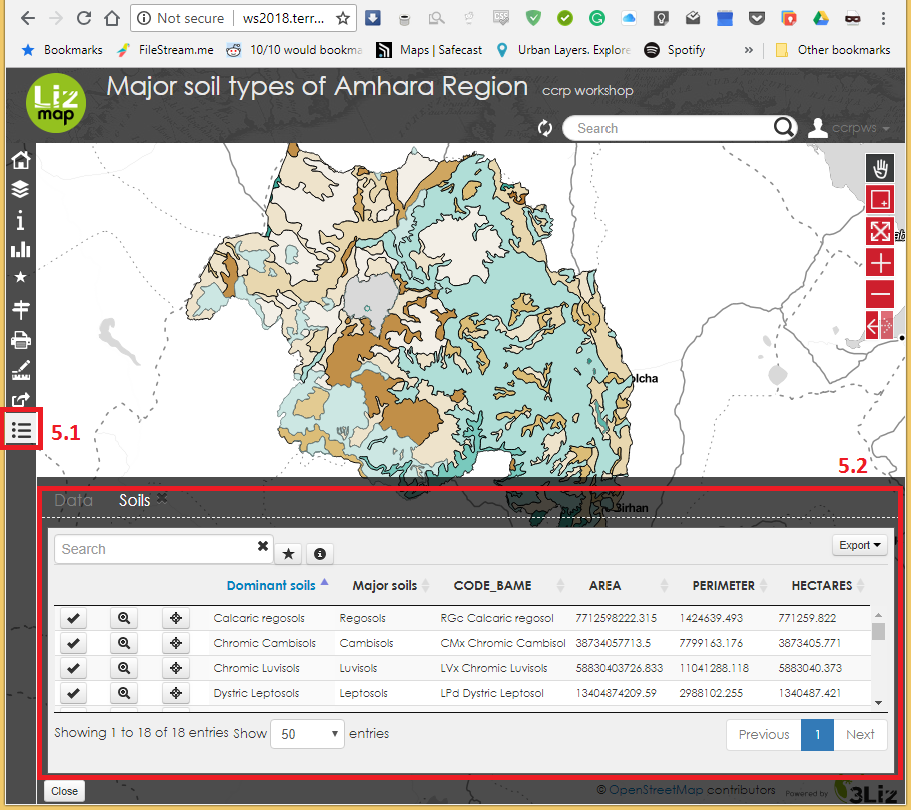
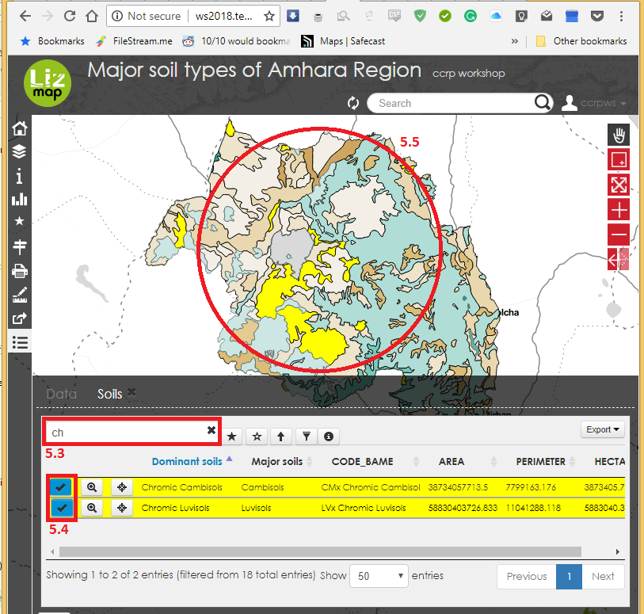
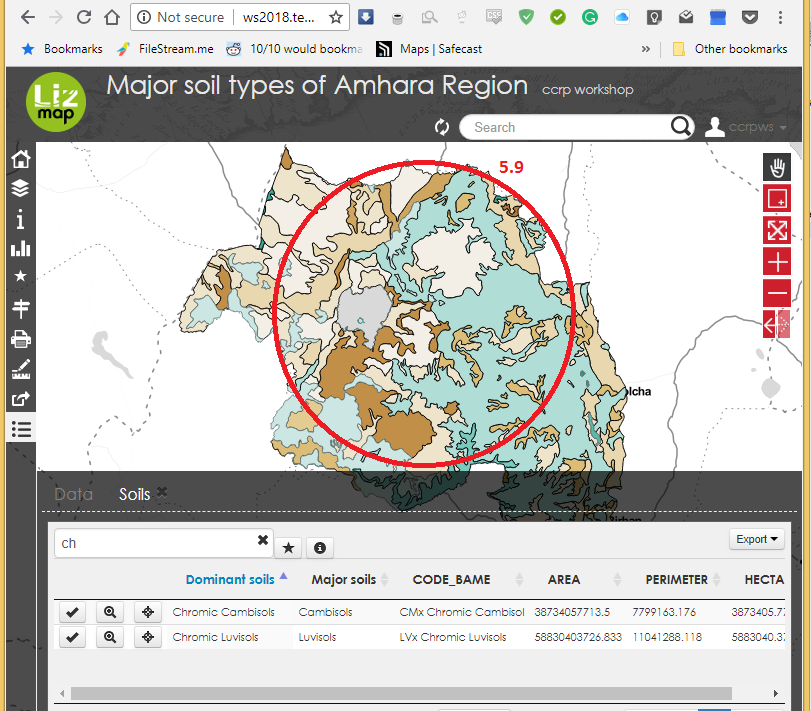

## Data View

[go back to main page](README.md)

## Adding a Data View

Step 1: Configure Layer Properties
 - Open layer properties in the layers panel (1.1).
 
 
 
 - Navigate to the fields tab (1.2).
 - Under the Alias column write down the new Alias names for the fields that will appear in the data table (1.3).
 - Check the selection boxes under the WMS and WFS columns to have the fields needed, become visible in the lizmap-Data View (1.4).

Step 2: Configure Project Properties
 - Open project properties and navigate to OWS Server(2.1).
 
 
 
 - Under the field, find WFS Capabilities (Also influemces DXF export) (2.2).
 - Check all the boxes under the Publish column (2.3) to create a dataview of the features' attribute table.
 - Under the columns update, insert and delete (2.4); check the boxes according to the edit function you would like the user to access.
 
 
 
 - Click apply then okay to save these changes.
 
 Step 3: Configure Lizmap
 - Open Lizmap window/plugin, either under the web dropdown(3.1) in the menu bar or the Lizmap icon found in the toolbar(3.2).
 
 

 - Click on the attribute tab in Lizmap and find the layer and Primary key dropdown menus.
 - Add layers to the above table by selecting them under layer drop down menu (3.3) and a choice of primary_key from one of the attribute table fields.
 

 
 - The select layer is included or excluded by clicking on add layer or remove layer (3.4) respectively; to apply these changes by clicking on apply (3.5) which publishes the vector layers as WFS. 

 

 ## Working with Data View 
 
 ### Zoom to Feature
 
 - Open the dataview tab by clicking the data button (4.1)on the left side panel of the web map.
 - Click on detail (4.2) aside the layer in which the feature you are looking for belongs to among the available layers; this opens up the layer dataview (4.3).
 - Select a feature by clicking on its corresponding tick sign (4.4)to highlight it, click on the zoom button (4.5)to have the map display zoom into the feature.
 - Minimizing the data shows the zoomed in feature (4.6).
 

 ### Filter
 
 - Open data view (5.2)by clicking on the dataview button (5.1).
  
  
 
 - Search for the record of interest in the dataview by typing in the search window (5.3).
 - Select the records of interst by clicking on the check of box (5.4), this is corresponded with a highlighting of the selected features records in the map display(5.5).
 
 
 
 - Click on the filter button (5.6) at the top of data view page to filter records (5.7); which are then displayed in the map view (5.8).
 - Unchecking the filter button removes the selection on both the dataview and the map display bringing back all the filtered features on the display (5.9).

