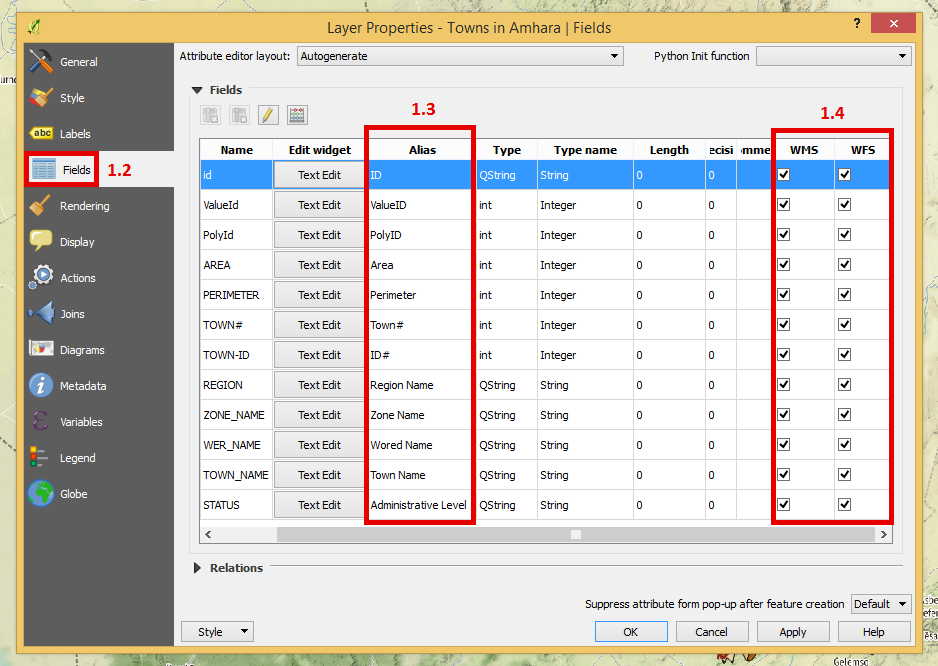
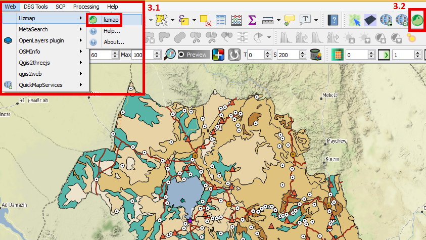

## Data View

[go back to main page](README.md)

### Adding a Data View

Step 1: Configure Layer Properties
 - Open layer properties in the layers panel (1.1).
 
 
 
 - Navigate to the fields tab (1.2).
 - Under the Alias column write down the new Alias names for the fields that will appear in the data table (1.3).
 - Check the selection boxes under the WMS and WFS columns to have the fields needed, become visible in the lizmap-Data View (1.4).

Step 2: Configure Project Properties
 - Open project properties and navigate to OWS Server(2.1).
 
 
 
 - Under the field, find WFS Capabilities (Also influemces DXF export) (2.2).
 - Check all the boxes under the Publish column (2.3) to create a dataview of the features' attribute table.
 - Under the columns update, insert and delete (2.4); check the boxes according to the edit function you would like the user to access.
 
 
 
 - Click apply then okay to save these changes.
 
 Step 3: Configure Lizmap
 - Open Lizmap window/plugin, either under the web dropdown(3.1) in the menu bar or the Lizmap icon found in the toolbar(3.2).
 
 

 - Click on the attribute tab in Lizmap and find the layer and Primary key dropdown menus.
 - Add layers to the above table by selecting them under layer drop down menu (3.3) and a choice of primary_key from one of the attribute table fields.
 

 
 - The select layer is included or excluded by clicking on add layer or remove layer (3.4) respectively; to apply these changes by clicking on apply (3.5) which publishes the vector layers as WFS. 

 

