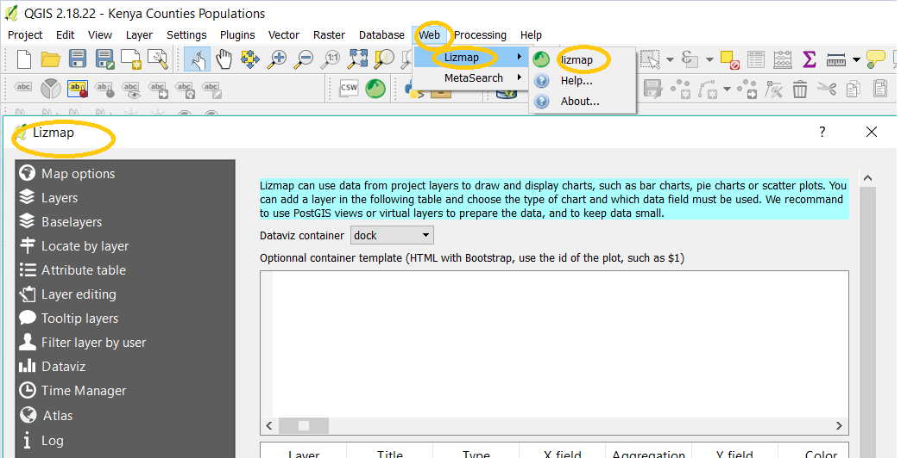
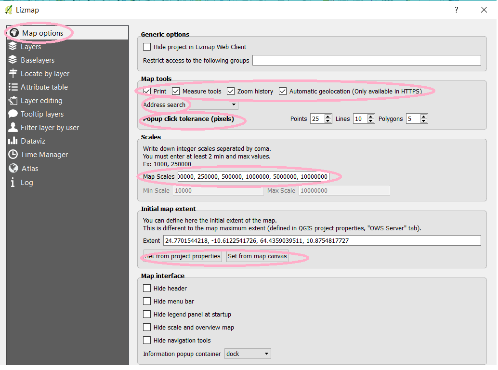
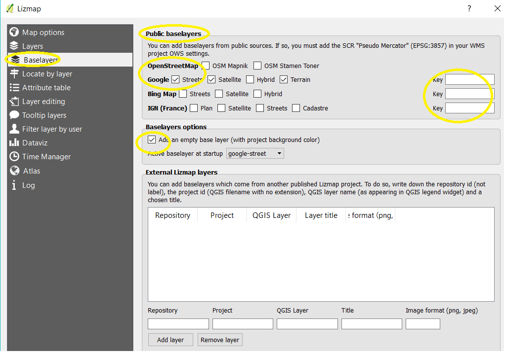
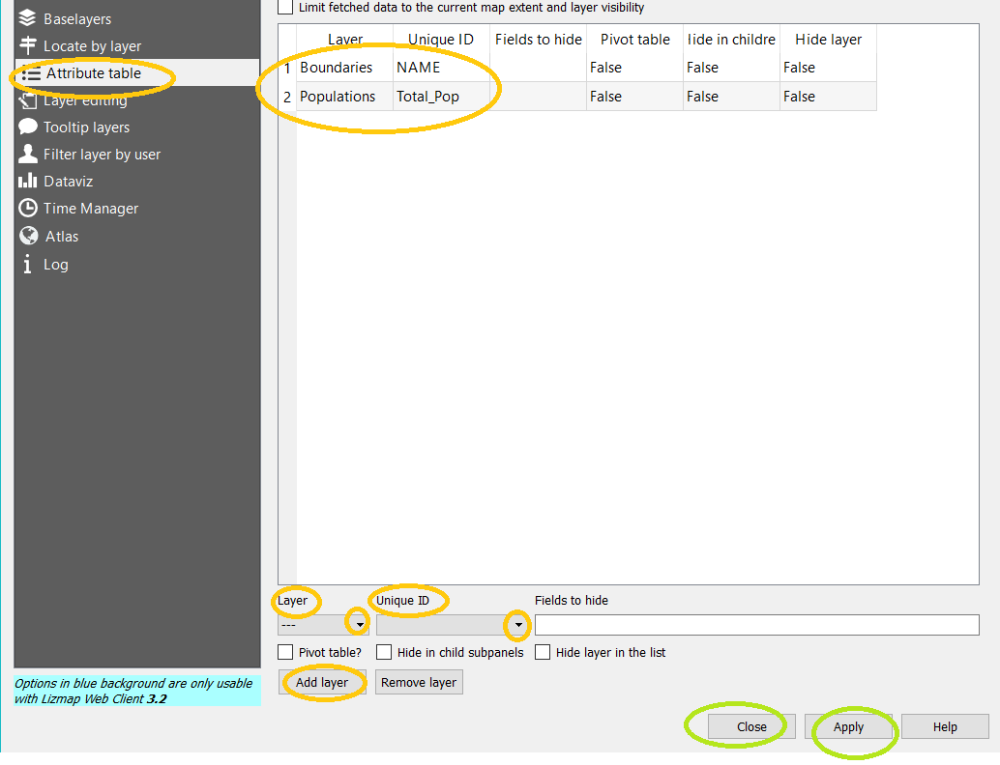

## Minimum Settings for a Webmap

[go back to main page](README.md)

Three files are needed to publish a web map using QGIS and Lizmap plugin;
	a. ProjectName.qgs			% this is the QGIS Project File
	b. ProjectName.qgs.cfg		% this is generated using Lizmap 
	c. ProjectName.qgs.png		% this is an image file used as a preview of the map being published

### QGIS PROJECT SETTINGS

	1. Launch 	QGIS
	2. Create a QGIS project
	3. Define Project properties as listed below:
		a. Under project Menu select Project Properties, the Project properties dialog box appears
		(Project Properties)
		b. Under General Settings, Type the project Title, while for the Save Path it is advisable to select relative path
		(Project Properties)
		c. For the CRS Settings, enable On-The-Fly CRS Transformation (OTF). Select your preferred CRS. It is advisable to select WGS84/PseudoMercator if you will use OSM and Google as Baselayer (CRS)
		d. OWS Server settings:
			- Enable service capabilities and fill in the required information e.g the Short Name, Title (This is what appears on the web map after publishing).
			(OWS - 1)
			- Under WMS Capabilities, enable Advertised Extents and CRS Restrictions (OWS - 1)
			- Select the used CRS (OWS - 1)
			- To define map extents - select use current canvas extent (OWS - 1)
			- Under WFS Capabilities check the publish option for all layers. (OWS - 2)
			- Finally run Test Configuration by selecting Laucnh, if all is fine, Select Apply then OK (OWS - 2)
		NOTE: - Common bugs that need to be fixed here include, conflictinf layer names and the Data Source Encoding where UTF8 is recommended
		- These settings result in the *.qgs file 
		
### LIZMAP PLUGIN SETTINGS

	1. Enable the Lizmap Plugin through following steps; Select Plugins Menu then Manage and Install Plugins, search for the Lizmap plugin and activate it, if not installed yet select the install option.(Plugin 1 & 2)
	2. The following minimum settings have to be done to publish a webmap
		Select Web Menu tab then Lizmap followed by Lizmap, the Lizmap dialog box appears; (Plugin 3) 
		i. Map Options, for the Map Tools enable: Print, Measure Tool, Zoom History and Automatic Geolocation (Plugin 4) 
		ii. Select the address Search e.g. Google (Plugin 4) 
		iii. Set the pop-up click tolerance (Units here are pixels)(Plugin 4) 
		iv. Under scales, to allow for zooming in and out of the webmap, input a number of specific scales (from the minimum to the maximum zoom level needed)(Plugin 4) 
		v. Set the Initial Map extent either by using: set from project properties or set from map canvas. (Plugin 4) 
		vi. Under Layers Option all the layers in the QGIS project are listed, the following settings can be done:
			- Metadata - Title - Type the Layer Title that will appear in the Legend
					   - Abstract - this is a brief description of the Layer 
					   - Link - give the url for the data source. (Plugin 5) 
			- Legend - check Toggled and display in legend tree. (Plugin 5) 
			- Pop-up - check activate pop-up - so that one can use the ID tool to get more details about the layer on the webmap. (Plugin 5) 
		vii. BaseLayers - here we select the baselayers that will appear in the background of the published map e.g. OpenStreetmap , Google (this requires a key),etc. (Plugin 6) 
		- under baselayers options check Add an empty baselayer. (Plugin 6) 
		viii. Locate by Layer (Plugin 7) 
		- at the bottom under layer select a layer and the display field for that layer and add the layer to the list for it to appear in the webmap
		ix. Attribute Table (Plugin 8) 
		- at the bottom select the layer and the unique ID and add the layer to the list 
		
		 Click - Apply then Close (Plugin 8) 
		 the above generates *.cfg file (the configuration file)
		 
### WEBMAP PREVIEW

A preview of the map is also needed when publishing a webmap, this comes in the form of a *.png file
Simple take a screen shot of the map and crop it in paint then save as ProjectName.qgs.png

		
