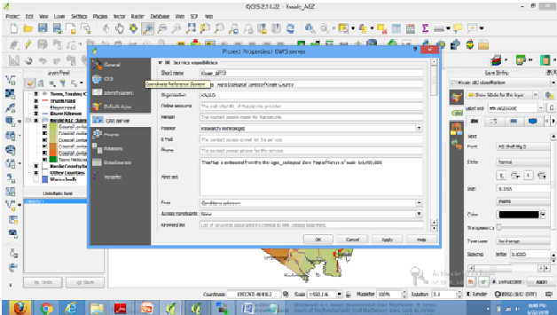
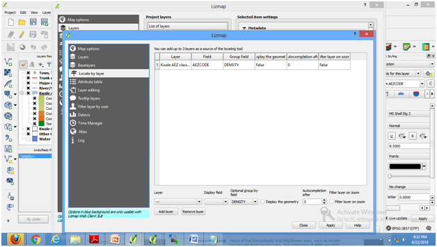

# Tips and tricks

[go back to main page](README.md)

# Detail Notes about Working with QGIS

## Layer Column
Layer column is generated in QGIS by loading the required layers for the end product (map making)then each layer is styled according to its function eg. roads are line features though at times you can show highways using double lines overlaying one another but of different widths and colour. 

Figure1A
Figure1B

To create this you right click on the layer, properties then click on the style in the property window and select the double line feature which shows a wide road or you can even use the symbol for a ditch and change the colours and even the line width to modify it to a presentable size symbol.

Figure2              

Towns can be of different colour depending on the back ground colours such as in a soil map or land use etc. Soil types, or Agro-ecological zones etc are polygon features therefore you have to select a fill colour and an outline colour or without outline (select no pen) in the outline bar. Look at the diagram below.

Figure3

You style your layers one by one by right clicking on the layer, property, style, library then select the symbol you want to use. Below the symbol box you will find a place where you can change the size and colour of your layer. Click ok when done. Repeat this for all the layers as appropriate.

After styling the layers, you need to lable the layers eg agro-ecological zone polygons need to be labled for identification. 
right click on the layer on your table of content (TOC), select properties, click on the labels icon which is yellow with some abc writings on it then at the top bar click and select show labels in this layer, just below that click and select the column of the attribute table to be used, in this case it is AEZcode. Set the text size, text colour then click on placement and set the best position for te text by navigating through the different positions shown in the box as you apply and go back to see position of the text. Repeat this for any layer that has some text even roads and rivers if required.
 
Figure4
Figure5

After creating the layer column in QGIS you click on project, project property then click on OWS server, check and fill in the project name, title, name of the organisation of the group or the person working on it. Position is optional then fill in the information about the map layers in the abstract box.

Figure6
Figure7

Check if the CRS is correct and if not you change by clicking on the plus button (+) below the CRS restriction, then CRS selector window opens, click on the right projection eg WGS 84/UTM zone 37S EPSG 32737 then click ok it will be loaded. If you want to use a basemap then you have to include the basemap CRS, in this case you select WGS84 Pseudo Mercator EPSG 3857 using the same procedure. Navigate down to WFS capabilities (also influences Dxf export) here you check all the layers you intend to publish in the published column. Scroll down to Test configuration, click on launch to check if the layers are acceptable for publishing, its like a preview of your layers. Click apply and Ok to accept.

Figure8
Figure9

Click on the Web in the main menue, select Lizmap, to your right select Lizmap with a round green icon besides it then Lizmap window appears. Select map options and check each box which is next to print, measure tools and zoom history. Move on to scales window below and set zoom level i.e you can add another figure eg 80000 depending on the scale of your map as shown in the figure. This will allow you to zoom in and out without limitations when navigating through your published map. Click on Apply.

Figure10
Figure11

Select the layer below the project layer name there is a list of layers window, click on the first layer and the window becomes active then on the popup panel put a check or click on the small box next to Activate popup as shown in the figure below. Repeat this process for the other layers then click apply and move to the baselayers and click on open streetmap or any other basemap you would like to use then click on apply.
 
Figure12
figure13

Select locate by layer navigate down below the table and click on the layer, you find a list of layer names you
had created in QGIS then select any layer you want to display in the layer table, select the display field for example
Agro-ecological zones and the field could be AEZcode then optional group by by field to density (any that you decide on) then when you click on the add layer, the information is displayed in the layer table above. see figure....
You can repeat the procedure for the other layers. Apply and close Lizmap.

Figure14

## Creating multiple styles of a layer (for use it web map)

You can generate different styles for the same layer and save them such that when you have published your map you can switch from one style to another in the same map. You can also copy a style from a map and use it in another by copying from one map, open the other map and right click on the layer, select style and paste.

Figure15

Right click on the layer, navigate to properties then to styles and set the new colours then click ok. Right click again on the layer, navigate to styles then click on add... then a new style box appears and you type in a name 
for the new style then click ok. The new style will be save in the styles. You can generate several styles. When you want to apply it in QGIS you right click on the layer you want to change then click on styles and you will find the different styles, click on the one you want and the layer will change automaticaly to match the new style.
You can go back to the original style which is saved as default under style.

Figure16
Figure17
Figure18

## Layout of QGIS Map

The layers have a sequence, the top most layer should be point formats eg towns etc. below should be line formats eg roads, rivers etc. but you will notice that trunk roads are placed first, followed by the major roads then tracks or footpaths. A river should always be below the road and if there is a railway line then this should come before the roads. Polygon features come below the line features. When you are done with your layers you make a layout b clicking on the project in the main menue then scroll to new print composer then a small window opens where you type the map name then click ok and a bigger window opens.
Set your page size then click on add newmap icon to then draw a rectangle on the window and the map appears. Set your map and legend properties by adjusting the sizes, colour etc on the item and item properties on your right of the composer. The layers have formed a map and you can save it as a jpeg, png etc for printing.

Layout map 

Note:The layers should be in the same projection otherwise they will not overlay.

