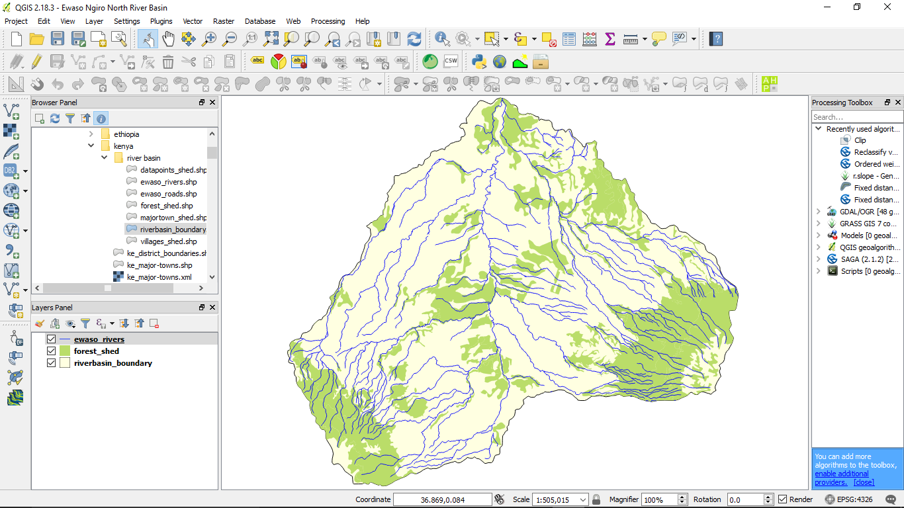

# Steps for Publishing a Web Map

[go back to main page](README.md)

## QGIS DESKTOP (Client Side)

- Prepare a qgis project and do the required styling.
- Do the minimum settings in project properties and save your project in your desired file directory as a *.qgs file. Example rivers.qgs
- Major point to note is that your Qgis project should be saved in a directory relative to where your data layers are saved. The data layer should be in the same directory or a sub-directory as the *.qgs file. 
- Do minimum settings in Liz map.
 Liz Map is a qgis plugin. If it is not installed in your Qgis software, you can install it from the plugins menu. If it does not appear, go to settings and enable the "Show Also Experimental Plugins".
 This settings in Liz Map yield the *.qgis.cfg file which is saved in the same directory as the *.qgs file.
 The *qgis.cfg is a configuration file which defines which and how elements will be displayed on the web map.
 
 - Prepare a *.qgis.png file. This can be created using any graphics creation software. An examples is Ms Paint, or a simple screen shot using the snipping tool in windows.
   The name of this image needs to correspond to the qgis project file. For example, if the project file is named rivers.qgs, the image file should be named as rivers.qgs.png.
   You can other image file formats like .jpg. .jpeg, .gif e.t.c.

## Server Side

[back to page top](#steps-for-publishing-a-web-map)

Transfer the files (*.qgs, *.qgs.cfg, *.qgs.png) from your machine to the Lizmap web server for publishing (using a secure FTP program, e.g. WinSCP on Windows).

N/B - The file structure in QGIS client side should be the same as the structure in the Liz Map web server. 
    - In the event of a mismatch, the structure may be re-organized in the server side.
    - If your data is in a different directory from where the qgis project is, the Liz Map plugin will not launch successfully. In this event, you can use the Qconsolidate plugin to bring together all the layers in the same directory as the qgis project (*.qgs)

However, you will have to restart your qgis project with the updated data directories for Liz Map to launch successfully.

## Configuration of Server and copying Data to the Server

[back to page top](#steps-for-publishing-a-web-map)

1. Download and install WinSCP- WinSCP is a free and open source software that allows file transfer between a local and a remote computer. Beyond this, WinSCP offers scripting and basic file manager functionality. 
   You can readily download it at https://winscp.net/eng/download.php
   Install it using the default settings.
   
2. Once installed, the software will launch a login panel with a file directory in the background. 
   On the login panel, leave the file protocol as SFTP. 
   For the host name, enter "terray.terragis.net".
   The port number should be "23".
   Under the username and password fields, fill in your username and password credentials.
   Click on the save button to save your site and login credentials. The "Save session as site" panel appears. For the "Site name", you can enter any name or leave the default name. For this example, the name chosen was TerraGIS. Click "ok". 
   Your site now appears on the left hand side of your panel. If you wish to change anything, click on the edit button.
   
3. After configuration, you can now login to the server. On clicking the login button you will be prompted to input your password again.
   Input the password and click "ok".

4. The panel that opens, is divided into two parts. The left side is a directory in your computer. The right side is a directory in the server.
   You can now transfer your files to the server by server by dragging them manually from a directory in your computer to a directory in the server. An easier way to do it would be to highlight the files and press "F5".
   In our case, our Qgis project(*.qgs) in the server should be stored in a directory "/home/data/ccrp". A sub directory called layers inside the "ccrp" directory is where the data layers will be stored.
   
__Important note:__

The relative path of where your data layers are saved in relation to your Qgis project should be maintained even on the server side. If not, your map will not display any data.

