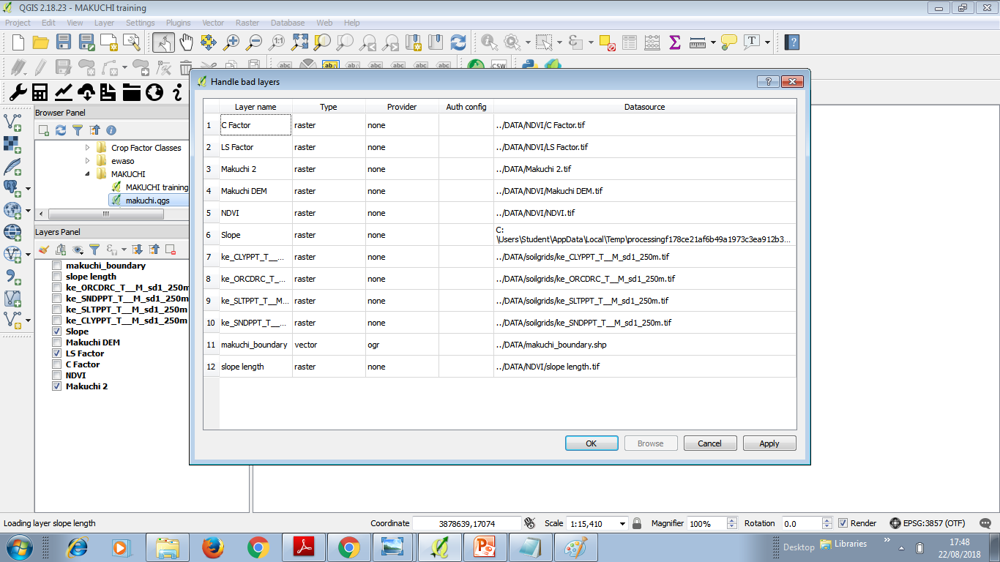
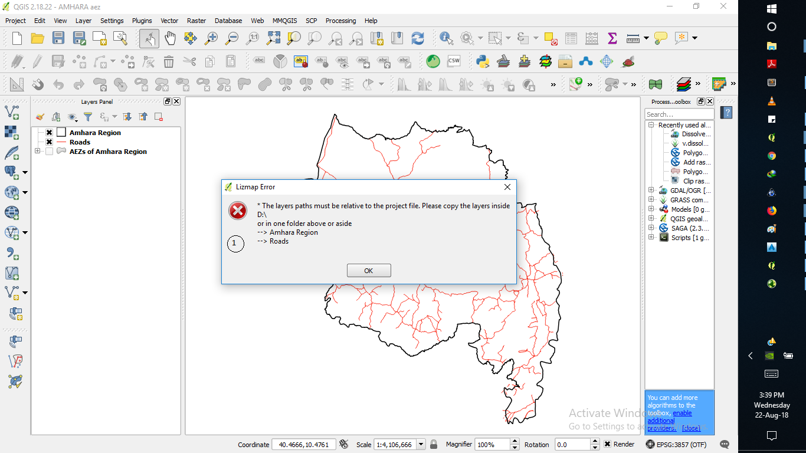

## Restrictions/ Prerequisites for Publishing Maps with Lizmap

* The QGIS project file (qgs) , the Lizmap configuration file (*.cfg) and the optional screen shot (*.png) need to be saved into the same directory on the server (the Lizmap Client Repository). The GIS data need to be saved into a layer directory adjacent to these files or into a subdiretory below (relative to the directory the QGIS project '*.qgs' file is located). 

* QGIS projects must be set to use relative paths.

* External base layers are available only when QGIS project is using WGS84 Pseudo Mercator projection (EPSG:3857).

* Spaces and dashes (aka minus signs) should not be used in naming files/layers. Underscores or CamelCase letters can be used instead.

* There is a restriction on the length of the QGIS project file in Lizamap so please avoid using names longer than 20 characters in order to make the web GIS project display (projects with longer file names failed to display in our exercises).

### Errors that are displayed

When GIS Data are not found when loading the QGIS project on QGIS Desktop. The window below can be used to fix/edit and adjust) the data path in order to display the data on the map. If such a project file is uploaded to the Server Computer the QGIS Server software as well will need to find the GIS Data in order to display them. In sase the server does not find the data in the same location (as the project was saved with on the users computer) the layers will not display on the web map.

Error displayed if GIS data used in the map are not the same directory (or a directory below) where the qgs file is located. If this is the case the Lizmap window in QGIS dektop can not be opened before this is fixed.

