# Working with Tools

[back to main page](read.md)

[create an anchor](#Print-tool) 

[Data Viz](#data-visualization-tool)

[create an anchor](#Locate-by-Layer) 

[create an anchor](#Adding-Base-Layers) 

[create an anchor](#Adding-Measure-Tool) 

# How to add tools in a Lizmap map

## Identify and Popup tool

In QGIS desktop with a loaded map, click on Project Properties/Identify Layers
* Check the layers you want to be used in the web map for identity
* Apply and save your work
* After publishing the map on the website, the identity tool (i) appears and when you click it and use it on the map the map features will be identified.

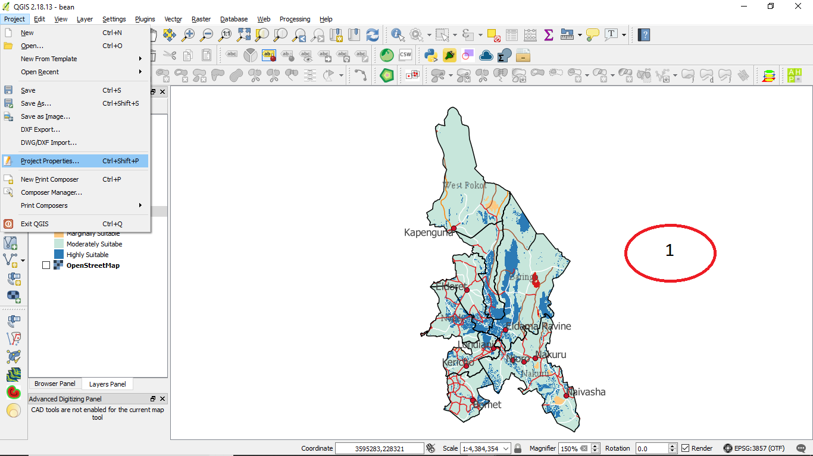
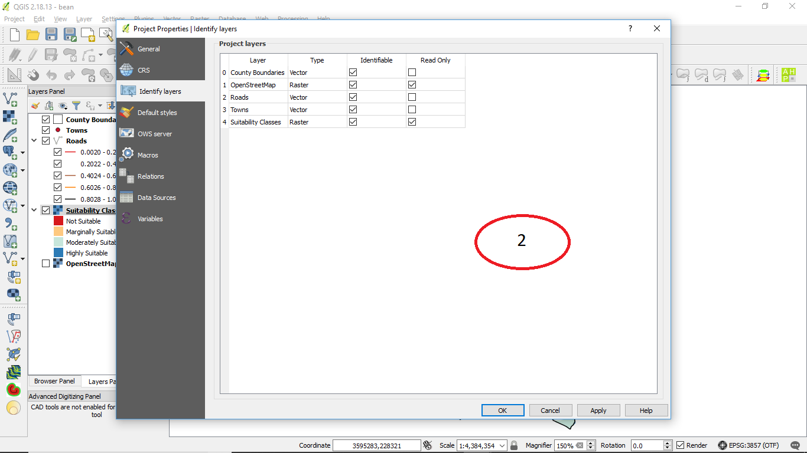

## Print tool

* Add a map layout in QGIS desktop
* Open Lizmap window and check the Print box under the maps tool
* Apply and save your work
* The print icon appears on the website when the work is published

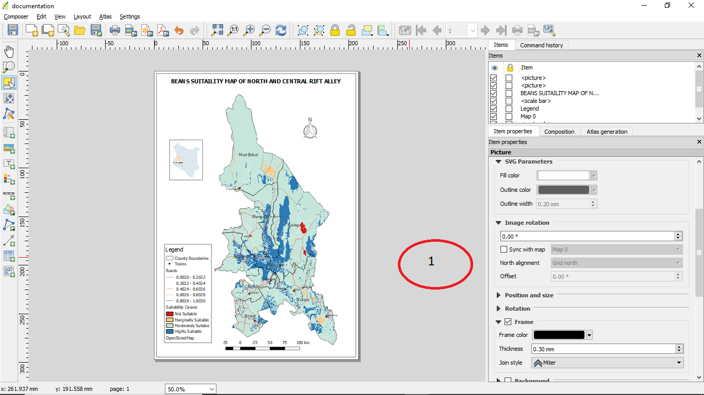
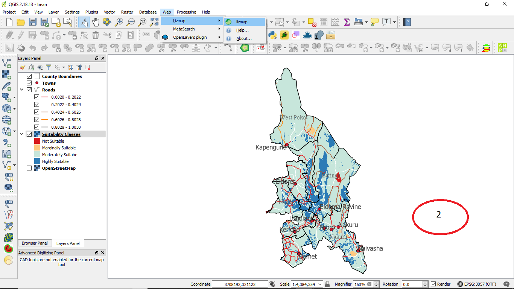
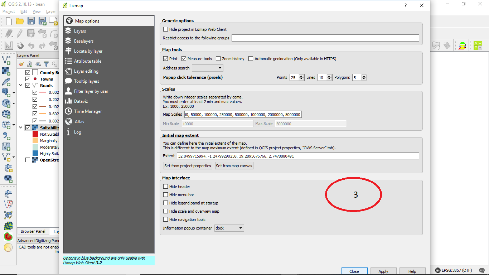

## Data Visualization Tool

When QGIS Project is set for web mapping or Publishing

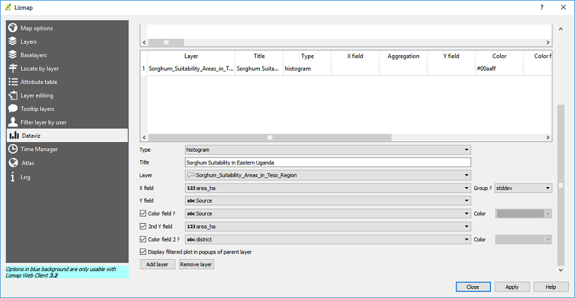

a) Click on the lizmap tool to open the lizmap dialogue box
b) Click on the DataViz tab 
c) In the window that opens; choose;
i) Type of visualization (Histogram, Scatter, Piechart, Box, etc
ii) Give the vizualisation a title (with no underscores)
iii) Choose the appropriate X &Y fields  (NB: These fields are inactive unless the WFS capability tool is checked in the Project Properties under the OWS Server tab
iv) Choose the appropriate colours for the vizualisation of the appropriate values in the X &y axes
v) Select any of the descriptive statistic parameter; stddev, avg, mean, etc, if applicable

## Locate by Layer

### Documentation on enabling/activating the Locate by layer and Tooltip 

1.	To Enable locate by layer 
As a prerequisite to be done on QGIS:, the corresponding check box of the WFS capabilities in the OWS Server tab of the Project Properties window must be checked. Otherwise the layers will not be able to be added to the list
=To enable the WFS capabilities, 
1)	open QGIS project Properties
2)	Click on OWS server tab (from the dialog box that pops up),
3)	Under the WFS capabilities click  check  the corresponding  boxes to the  right of  each layer name
See picture: Prerequisite_QGIS_steps 

### Steps on Lizmap plugin

When some selected layers are added to the tool Locate by layer, a drop down list of the layers appears on the Lizmap. This enables to select one name in this list zoom to the selected layer and  the geometry is displayed (if display geometry is checked) 
Make sure that Lizamap plugin is installed and activated 
1.	From QGIS Web menu, open Lizamap plugin
See picture: Enabling Lizamp plugin
2.	Click on locate by layer tab
3.	Click on the layers dropdown list, 
4.	Select the layer and the corresponding field name under Display field drop down list.
5.	For each selected  layer, click add layer button to populate the table above it
6.	Click on display geometry check box (optional)
7.	To remove layer, select and  click remove layer button
8.	Click Apply
See Picture: locate by layer steps on lizmap
2.	Tooltips

For the prerequisites, see Prerequisite_QGIS_steps

1.	To enable Tooltips on Lizmap plugin, see picture: Enabling Lizamp plugin
2.	Click on Tooltips tab 
3.	From the layers dropdown list, select the layer to display
4.	For each selected  layer, click add layer button to populate the table above it
5.	To remove layer, select and  click remove layer button
6.	Click on display geometry check box (optional)
7.	Click Apply

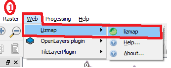

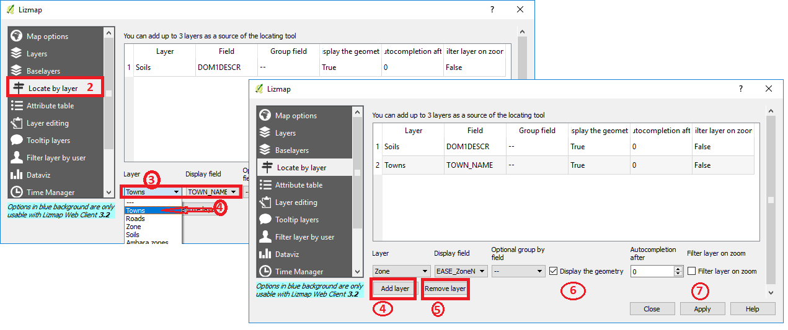

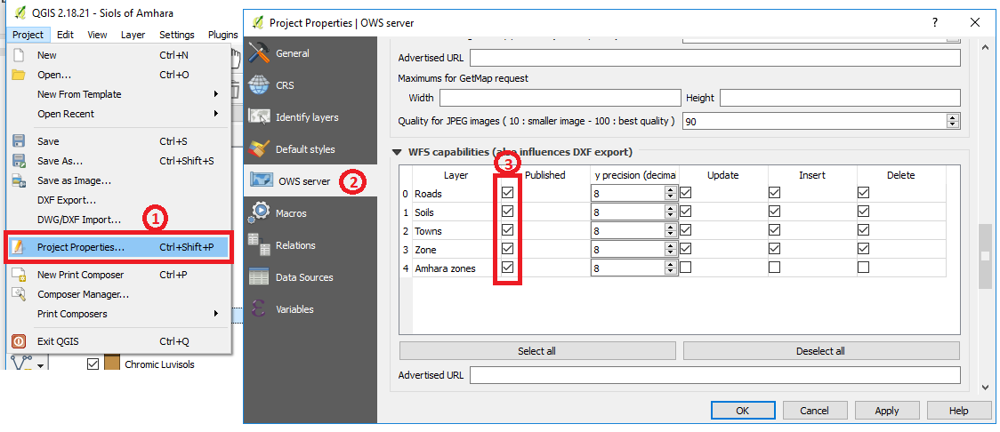

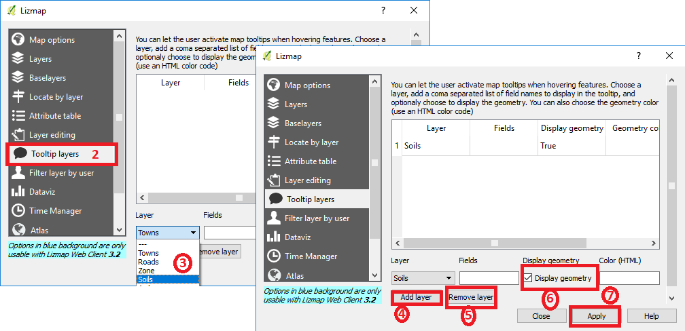

See picture: Tooltip_ steps_on_Lizmap_plugin

### Adding Base Layers

To add base map layers to the map, one needs to have the qgs project
On the lizmap plugin, select the baselayers tab.

Under the baselayers tab, Base maps from different sources are available. These are: 
Open Street Map – OSM Mapnik and OSM Stamen Toner
Bing Maps – Streets, Satellite, Hybrid and Terrain.
Google Maps - Streets, Satellite and Hybrid.  
IGN (France) – Plan, Satellite, Streets and Cadastre. 

AVAILABLE BASE LAYERS
In order to access the Google, Bing and IGN maps, you will need an api-key (application programming interface - key). 
This key gives access to a single map that allows the user to load base maps from these sources. 
As for the Open Street Maps layers, an api-key is not required.

The base layers are selected as shown in the figure below.
After selecting the required basemap(s), apply and save edits on the qgs project. 

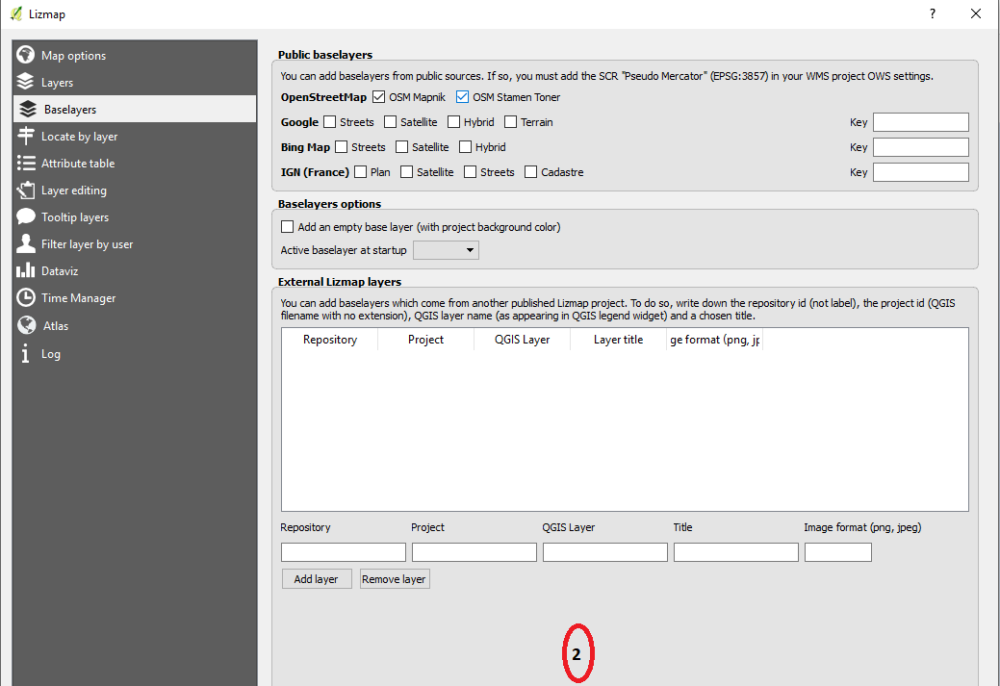

### Adding Measure Tool

On the Lizmap plugin, select the Map options tab 
Under the map tools select the measure tool which enables measurement in the map (Length, Area and Perimeter)
Apply and close the plugin 
Save edits in qgs project.

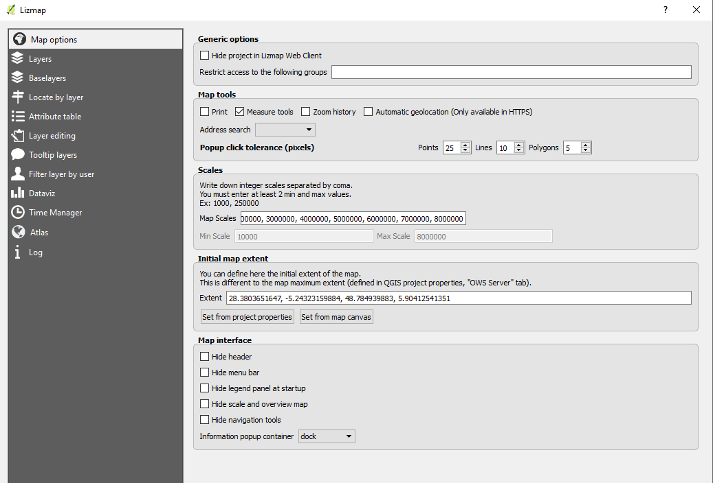

